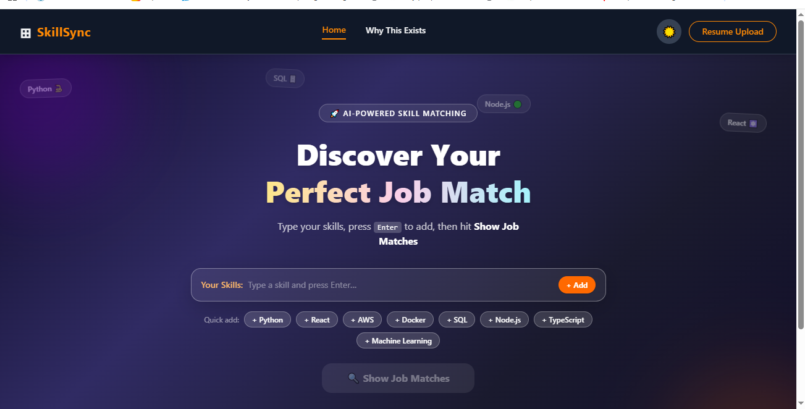

# Skill Matching Website

## Introduction
Welcome to the **Skill Matching Website** – your personalized career roadmap generator! This platform helps users discover the best career paths based on their current skills and job preferences. By entering your skills and preferred job roles, the system provides:

- **Customized Skill Matching:** Identify which of your skills align with your dream job.
- **Job Preference Insights:** Find roles that suit your interests and expertise.
- **Personalized Roadmap:** Receive a step-by-step guide for upskilling, certifications, and experience needed to achieve your career goals.

Whether you’re a student exploring career options, a professional switching roles, or someone planning to upskill, this platform makes career planning simple, precise, and actionable.

## Screenshots

Here are some screenshots of the **Skill Matching Website** in action:

### Homepage


## Features
- Enter your current skills and preferred job roles.
- Get a list of recommended jobs that match your profile.
- View a personalized roadmap with skills to learn, courses, and certifications.
- Track your progress and update your skills to refine recommendations.

## Tech Stack
- **Frontend:** HTML, CSS, JavaScript ( React.js)
- **Database:** MySQL 
- **Visualization:** Charts or roadmap visualization with D3.js or similar libraries

## How to Use
1. Clone the repository:  
   ```bash

   git clone <repository-url>
   cd <skill-sync>
   npm install
   npm run dev
   
This keeps it **minimal, clear, and easy for anyone to follow**.  

